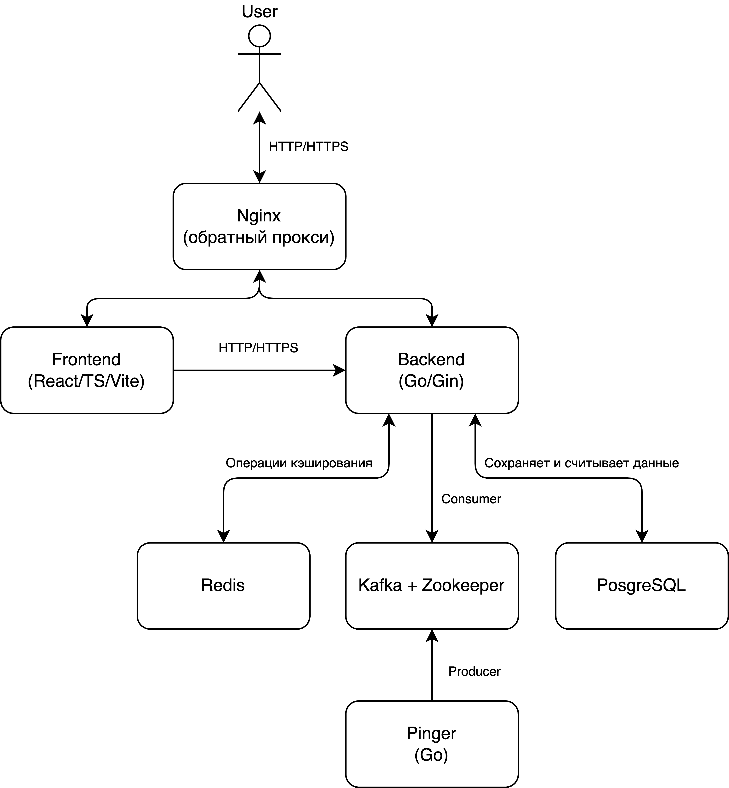

# VK-Container-Pinger

VK-Container-Pinger — это система мониторинга Docker-контейнеров, которая автоматически пингует контейнеры, собирает данные об их доступности и времени отклика, а затем сохраняет эти данные в базе данных. Результаты доступны через RESTful API, а также отображаются во фронтенд-приложении. Проект использует современные технологии, такие как Docker, Kafka, PostgreSQL, Redis, Go и React (с Vite и TypeScript).

## Функциональность

- **Пинг контейнеров:**  
  Сервис *Pinger* регулярно получает список запущенных контейнеров через Docker API хоста, пингует их с заданным интервалом и публикует результаты в Kafka.

- **Сохранение и обработка данных:**  
  *Backend*-сервис принимает данные пингов (через Kafka), сохраняет их в базе данных PostgreSQL с upsert‑логикой (если контейнер с данным IP уже существует, обновляет запись) и предоставляет RESTful API для доступа к данным.

- **Веб-интерфейс:**  
  Фронтенд-приложение, разработанное на React с использованием Vite и TypeScript, отображает данные о пингах в виде таблицы, поддерживает сортировку, фильтрацию и переключение между светлой и темной темами.

- **Обратный прокси (опционально):**  
  Nginx может использоваться как единая точка входа, маршрутизирующая запросы к API и статику.

## Архитектура

Проект состоит из следующих основных компонентов:

- **PostgreSQL:** Хранит результаты пингов.
- **Redis:** Используется для кэширования.
- **Zookeeper & Kafka:** Отвечают за обмен сообщениями между сервисами.
- **Backend:** RESTful API, написанный на Go (с Gin), который обрабатывает данные пингов.
- **Pinger:** Сервис мониторинга, написанный на Go, который пингует контейнеры и отправляет результаты в Kafka.
- **Frontend:** Веб-приложение на React (с Vite и TypeScript), отображающее данные в виде таблицы.
- **Nginx (опционально):** Обратный прокси для маршрутизации запросов (если используется).



## Стек технологий

- **Backend & Pinger:** Go, Gin, Docker, PostgreSQL, Redis, Kafka, Zookeeper  
- **Frontend:** React, Vite, TypeScript, Ant Design  
- **Обратный прокси:** Nginx  
- **Оркестрация:** Docker Compose

## Установка и запуск

### 1. Клонирование репозитория

```bash
git clone https://github.com/MTXIK/VK-Container-Pinger.git
cd VK-Container-Pinger
```

### 2. Запуск с Docker Compose

Из корневой директории проекта выполните:

```bash
docker-compose down -v  # удалите старые volume, если нужно
docker-compose up --build
```

Это запустит следующие сервисы:
- **PostgreSQL** на порту 5432
- **Redis** на порту 6379
- **Zookeeper** на порту 2181
- **Kafka** на порту 9092
- **Backend** на порту 8080
- **Pinger** (работает в фоне)
- **Frontend** на порту 3000
- **Nginx** (если используется) на порту 80

### 3. Доступ к сервисам

- **Frontend:** Откройте браузер и перейдите по адресу [http://localhost:3000](http://localhost:3000). Здесь вы увидите веб-интерфейс с таблицей пингов.
- **Backend API:** Для тестирования API можно использовать Postman или cURL. Пример:
  ```bash
  curl http://localhost:8080/api/pings
  ```
- **Nginx (опционально):** Если настроен, Nginx будет доступен по [http://localhost](http://localhost) и маршрутизировать запросы к backend и frontend.

## Функциональные особенности

- **Пинг контейнеров:**  
  Pinger получает список запущенных контейнеров с Docker API хоста, пингует их с интервалом (например, каждые 10 секунд) и отправляет результаты в Kafka.

- **Обработка данных:**  
  Backend принимает сообщения из Kafka, сохраняет их в базе данных PostgreSQL, используя upsert‑логику (если контейнер с данным IP уже существует, обновляет запись).

- **Отображение данных:**  
  Фронтенд-приложение отображает полученные данные в виде таблицы с поддержкой сортировки по столбцам и дополнительным столбцом статуса (например, "Probably Up"/"Probably Down").

- **Переключение темы:**  
  Фронтенд поддерживает переключение между тёмной и светлой темами, что улучшает пользовательский опыт.